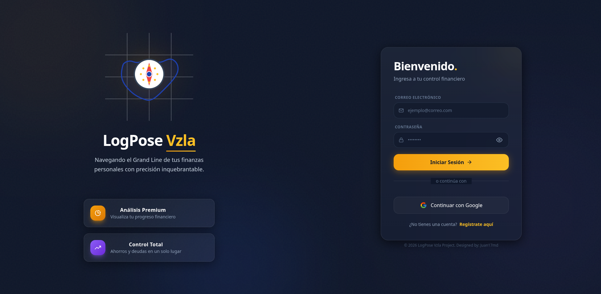

# LogPose Vzla 💰

> **LogPose Vzla** es una avanzada plataforma de gestión financiera personal diseñada para ofrecer una experiencia visual premium y una funcionalidad robusta. Inspirada en la estética *Glassmorphism* y el diseño moderno, esta aplicación permite un control total sobre tus finanzas con la ayuda de un asistente inteligente basado en IA.

<p align="center">
  
</p>

[](https://nextjs.org/)
[](https://www.typescriptlang.org/)
[](https://tailwindcss.com/)
[](https://firebase.google.com/)
[](https://groq.com/)

---

## ✨ Características Principales

### 🖥️ Dashboard Inteligente & UI Premium
*   **Diseño Glassmorphism**: Una interfaz moderna y translúcida que proporciona una experiencia de usuario fluida y profesional.
*   **Widgets Dinámicos**: Visualización en tiempo real de ingresos, gastos, ahorros y metas financieras.
*   **Conversión en Tiempo Real**: Sincronización automática con la tasa oficial del BCV (caché de 15 min).

### 🤖 Asistente Financiero "Nami"
*   **IA Personalizada**: Integramos el SDK de Groq para ofrecer recomendaciones financieras basadas en tus datos reales.
*   **Análisis Predictivo**: Consulta tu situación financiera y recibe consejos sobre cómo optimizar tus ahorros.

### 🎯 Gestión de Metas y Ahorros
*   **Objetivos Claros**: Establece metas de ahorro con barras de progreso visuales.
*   **Billetera Multi-Divisa**: Soporte completo para Efectivo en $ y BS, además de activos digitales como USDT.

### 📋 Herramientas de Control
*   **Listas de Compras**: Calculadora integrada con tasas de cambio y seguimiento de artículos.
*   **Deudas y Gastos Fijos**: Registro organizado de compromisos financieros recurrentes.

---

## 🛠️ Stack Tecnológico

| Componente | Tecnología |
| :--- | :--- |
| **Frontend** | [Next.js 15](https://nextjs.org/) (App Router), [React 19](https://react.dev/) |
| **Estilizado** | [Tailwind CSS v4](https://tailwindcss.com/), [Framer Motion](https://www.framer.com/motion/) |
| **Backend & Auth** | [Firebase](https://firebase.google.com/) (Firestore, Authentication) |
| **Inteligencia Artificial** | [Groq Cloud SDK](https://groq.com/) |
| **Gráficos** | [Recharts](https://recharts.org/) |
| **Formularios** | [React Hook Form](https://react-hook-form.com/) con [Zod](https://zod.dev/) |

---

## 🚀 Instalación y Configuración

Sigue estos pasos para ejecutar el proyecto localmente:

### 1. Clonar el repositorio
```bash
git clone https://github.com/Juan17md/logpose_vzla.git
cd logpose_vzla
```

### 2. Instalar dependencias
```bash
npm install
```

### 3. Configurar variables de entorno
Crea un archivo `.env.local` en la raíz del proyecto y añade tus credenciales:
```env
NEXT_PUBLIC_FIREBASE_API_KEY=tu_api_key
NEXT_PUBLIC_FIREBASE_AUTH_DOMAIN=tu_dominio
NEXT_PUBLIC_FIREBASE_PROJECT_ID=tu_project_id
NEXT_PUBLIC_FIREBASE_STORAGE_BUCKET=tu_storage_bucket
NEXT_PUBLIC_FIREBASE_MESSAGING_SENDER_ID=tu_sender_id
NEXT_PUBLIC_FIREBASE_APP_ID=tu_app_id
GROQ_API_KEY=tu_groq_api_key
```

### 4. Iniciar el servidor de desarrollo
```bash
npm run dev
```
Accede a [http://localhost:3000](http://localhost:3000) para ver la aplicación en acción.

---

## 👤 Desarrollado por

**Juan17md** - *Full Stack Developer*
---